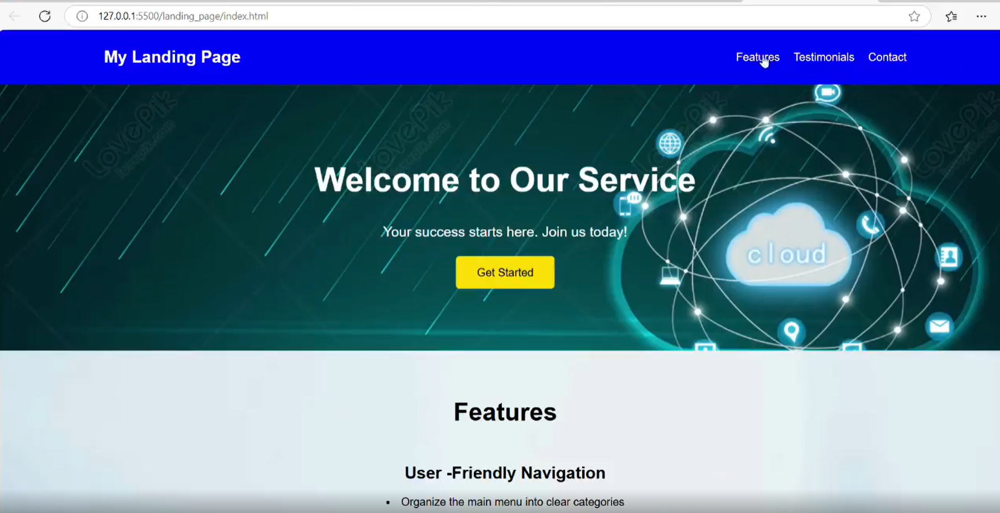
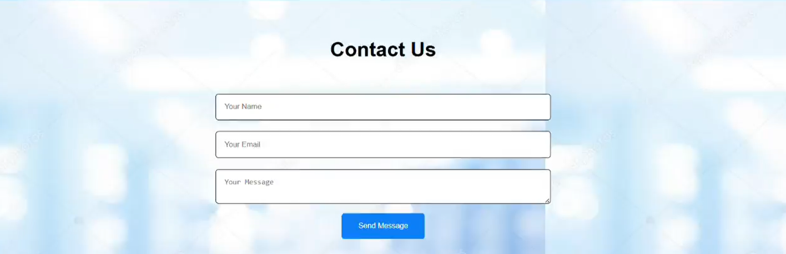

# 🌐 Responsive Landing Page

A modern and responsive **Landing Page** built using **HTML5** and **CSS3**. This project focuses on creating an attractive user interface with a clean layout, responsive design, and smooth user experience across different devices.

## 🚀 Features

* 📱 Fully Responsive Design
* 🎨 Modern and Clean User Interface
* ⚡ Fast Loading Performance
* 🖥️ Cross-Browser Compatibility
* 📂 Well-Organized Project Structure
* 📐 Mobile-Friendly Layout

## 🛠️ Technologies Used

* HTML5
* CSS3

## 📸 Screenshots

### 🏠 Home Page

### 📞 Contact Us

### 💬 Feedback

## 📁 Project Structure

...
Landing-Page/
│── index.html
│── style.css
│── images/
│── README.md
...

## 💻 Getting Started

1. Clone the repository

bash
git clone https://github.com/anshika2410-hub/Landing-Page.git

2. Open the project folder.

3. Run the `index.html` file in your browser.

## 🎯 Learning Outcomes

* Responsive Web Design
* CSS Flexbox
* CSS Grid
* UI Design Principles
* Layout Structuring
* HTML Semantics

## 🔮 Future Improvements

* Add JavaScript animations
* Implement Dark Mode
* Improve Accessibility
* Add Contact Form
* Enhance User Interactions

## 👩‍💻 Author

**Anshika**

Frontend Developer | HTML | CSS | JavaScript | Learning React

---

⭐ If you like this project, consider giving it a **Star** on GitHub!
